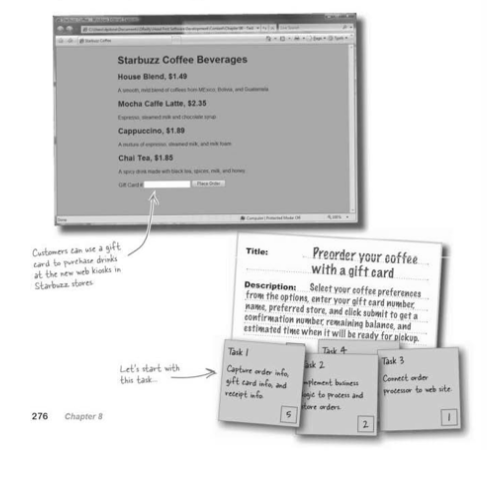
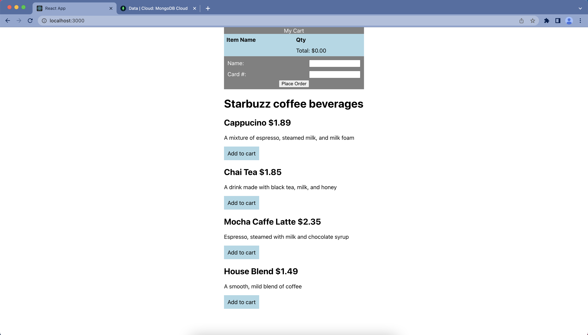

This project was made for fun. Inspired by book 'headfirst software engineering'

Features
- reads beverage info from mongoDB database
- allows a user to place an order with a gift card. the balance is reflected in the database
- can add as many items as you want to cart

